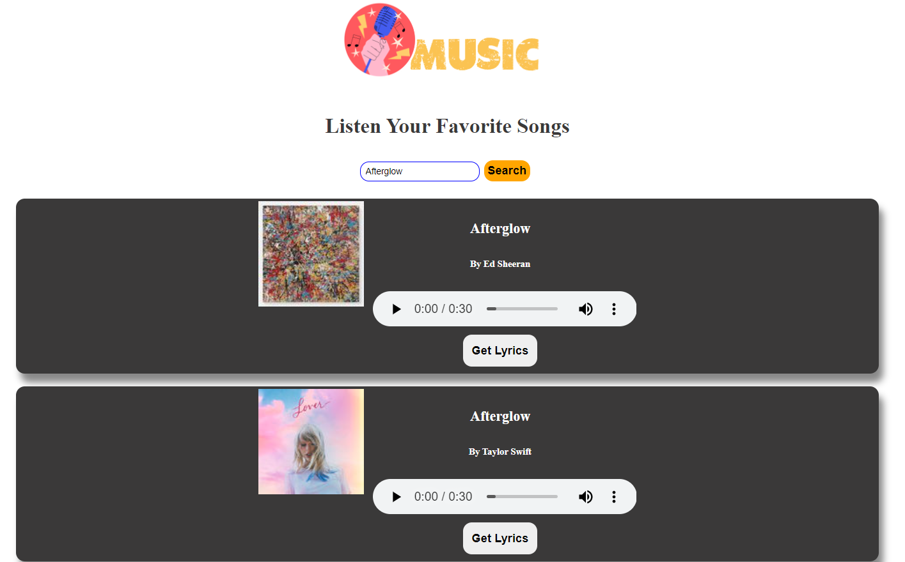

# A Music App

This simple music app uses Reactjs,Reactjs hooks,REST API

## Feature

- Search any music by artist or song name
- listen audio music
- Can get the lyrics of songs

## Installation

Clone the repository:

```
git clone https://github.com/Isratjahansumiya/React-Music-App.git
```

Navigate inside the directory:

```
cd React-Music-App
```

Install all the necessary dependecies:

```
npm install
```
Then run:

```
npm start
```

## Used Rest APIs

### Search Song

API link: https://api.lyrics.ovh/suggest/:searchText

Example: https://api.lyrics.ovh/suggest/baby

### Get lyrics

API link: https://api.lyrics.ovh/v1/:artist/:title

Example: https://api.lyrics.ovh/v1/Justin%20Bieber/Baby